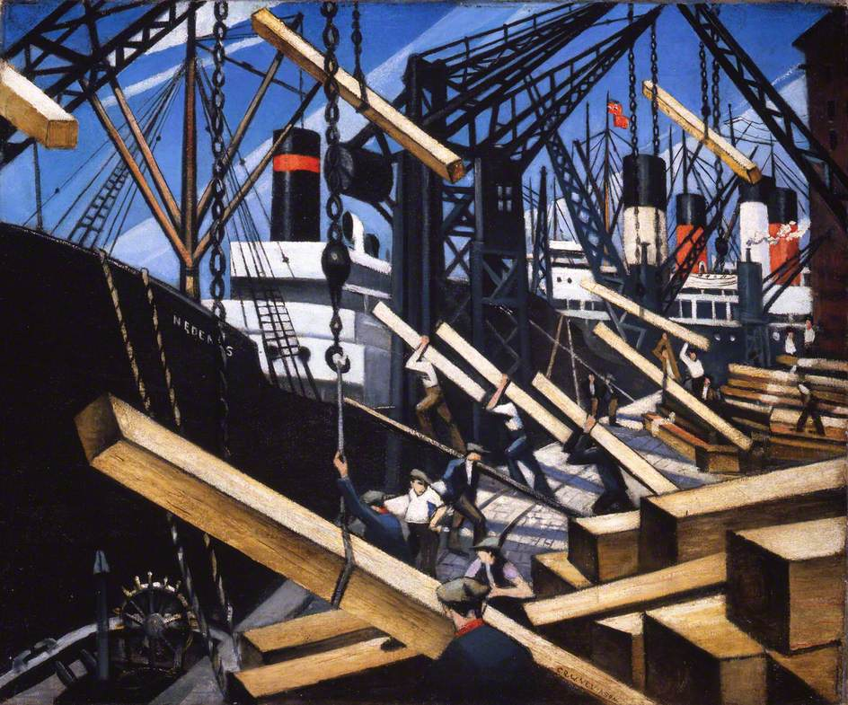

[](https://www.wikiart.org/en/c-r-w-nevinson/loading-timber-at-southampton-docks-1917)

This quick tutorial explains how to upload files with GraphQL using only plain JavaScript and no frameworks or libraries. It's not meant as a complete tutorial as I won't be covering the backend side of the implementation.

### The specs

A general specification for file uploads through GraphQL can be found [on Github](https://github.com/jaydenseric/graphql-multipart-request-spec).

The idea is to send a [multi-part form request](https://developer.mozilla.org/en-US/docs/Web/API/FormData) to the server which enables you to easily upload multiple files in one request.

As the specs point out, the following GraphQL query should be sent to the server:

```GraphQL
{
  query: `
    mutation($file: Upload!) {
      singleUpload(file: $file) {
        id
      }
    }
  `,
  variables: {
    file: File
  }
}
```

Which then will be uploaded as a multi-part form request:

```
--------------------------cec8e8123c05ba25
Content-Disposition: form-data; name="operations"

{ "query": "mutation ($file: Upload!) { singleUpload(file: $file) { id } }", "variables": { "file": null } }
--------------------------cec8e8123c05ba25
Content-Disposition: form-data; name="map"

{ "0": ["variables.file"] }
--------------------------cec8e8123c05ba25
Content-Disposition: form-data; name="0"; filename="a.txt"
Content-Type: text/plain

Alpha file content.

--------------------------cec8e8123c05ba25--
```

## The details

Let's have a look at the different parts of the form request.

1. `operations` contains the GraphQL query:

```
--------------------------cec8e8123c05ba25
Content-Disposition: form-data; name="operations"
{ "query": "mutation ($file: Upload!) { singleUpload(file: $file) { id } }", "variables": { "file": null } }
```

2. `map` is responsible for the mapping between the file-variable in the GraphQL query and the file attached to the request:

```
--------------------------cec8e8123c05ba25
Content-Disposition: form-data; name="map"

{ "0": ["variables.file"] }
```

3. And the file fields contain the actual files themselves:

```
--------------------------cec8e8123c05ba25
Content-Disposition: form-data; name="0"; filename="a.txt"
Content-Type: text/plain

Alpha file content.

--------------------------cec8e8123c05ba25--
```

So far so good. But how do we implement a request like this in plain JavaScript?

## The client

Let's imagine we have the following HTML markup for a form:

```html
<form action="/graphql">
  <input type="file" name="myfile" />
  <button>Upload</button>
</form>
```

All we need to do is create a `formData` request like so:

```javascript
const formData = new FormData()
```

Create the `operations` field, containing the GraphQL query, and append it to the form request:

```javascript
const operations = `{ "query": "mutation ($file: Upload!, $path: String) { upload(file: $file, path: $path) }", "variables": { "file": null, "path": "coins" } }`
formData.append("operations", operations)
```

Add the `map` field with the variables and the actual file:

```javascript
const map = `{"0": ["variables.file"]}`
formData.append("map", map)
formData.append("0", event.target.files[0])
```

_For the sake of this example I referenced the file directly from the form, assuming the upload is triggered by an event._

And lastly, send it to the server, using `fetch`:

```javascript
fetch("/graphql", {
  body: formData,
  method: "post",
})
```

If all goes well and your server is implemented according to the previously mentioned specification, you should be able to upload files with just plain old JavaScript. No need for a fancy library or framework. Which doesn't mean that those frameworks are bad by the way... I just feel sometimes it's not needed.

## Multiple files

In case you want to upload multiple files, all we have to do is modify the GraphQL query to contain a list of files instead of just one file:

```GraphQL
{
  query: `
    mutation($file: Upload!) {
      singleUpload(file: $file) {
        id
      }
    }
  `,
  variables: {
    files: [
      File,
      File
    ]
  }
}
```

Add the mappings between the files and the variables to the `map` operation and append the files:

```javascript
const map = `{"0": ["variables.files.0"], "1": ["variables.files.1"]}`
formData.append("map", map)
formData.append("0", event.target.files[0])
formData.append("1", event.target.files[1])
```

The rest is the same as the one-file example.

If you have questions, concerns or just want to say Hi 👋, hit me up on [Twitter](https://twitter.com/neither1nor0).
