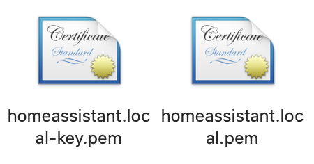

You probably know the pain. You want to be smart and try to run all the different services locally in your home network to secure yourself against any possible attacks from the outside. But still, there is this one annoying thing:


While, in my opinion, it's not too much of a security issue (since the whole traffic is contained to your home network), it's still bothering me to always have to add an exception for every local site I visit.

## Meet mkcert

There are a lot of examples on the web on how to create self-signed certificates that you then can add to your certificate store and get around the unsecured-issue. But they all seem to be rather complicated and take a lot of time. So I tried to find a simpler solution and stumbled upon [mkcert](https://github.com/FiloSottile/mkcert), a zero-config tool to make locally trusted certificates, by [Filippo Valsorda](https://filippo.io/).

This tool basically lets you turn any domain into a trusted domain (aka. the locked lock in your URL bar). And it does this by running one command only, which is pretty sweet if you asked me.

I'm not going to explain how to install it here since the GitHub page of mkcert explains it pretty well. There are examples for macOS, Linux, and Windows. One caveat might be, that it's a command-line tool, so be sure to freshen up those hacking skills 😉.

There're [instructions](https://github.com/FiloSottile/mkcert#mobile-devices) on how to install the root-certificate on iOS. Make sure to [enable full trust](https://support.apple.com/en-nz/HT204477) after installing it (which I forgot and got really frustrated…).

## Installation in Home Assistant

If you installed mkcert and ran it correctly for your Home Assistant installation, you should get two certificate files:



Copy those two files to your `/ssl` directory in your Home Assistant installation. Then, adapt your `configuration.yaml` file accordingly:

```yaml
http:
  ssl_certificate: /ssl/homeassistant.local.pem
  ssl_key: /ssl/homeassistant.local-key.pem
```

(Make sure to change the filenames of the certificates to the ones you generated)

Now restart Home Assistant and depending on your browser, it should pick up the proper certificate from the server and you'll be greeted by a shining grey **locked** lock 🎉:


## Conclusion

As you see, it's super easy to generate a certificate that's accepted in the browser as valid, without hammering in 100 different commands. Of course, this isn't the _most_ secure method of doing it. But again, since you're in your own private home network, this shouldn't be too much of an issue. Plus, this method works for other services too. I use it to secure all of my locally hosted services like Synology NAS Diskstation, Nextcloud, etc.
