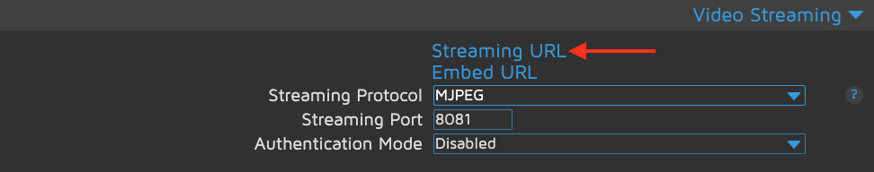
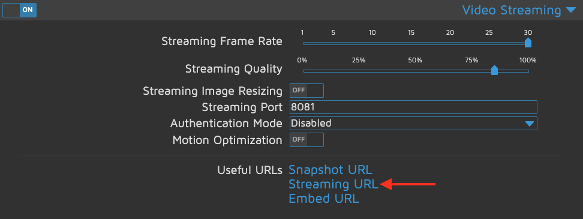
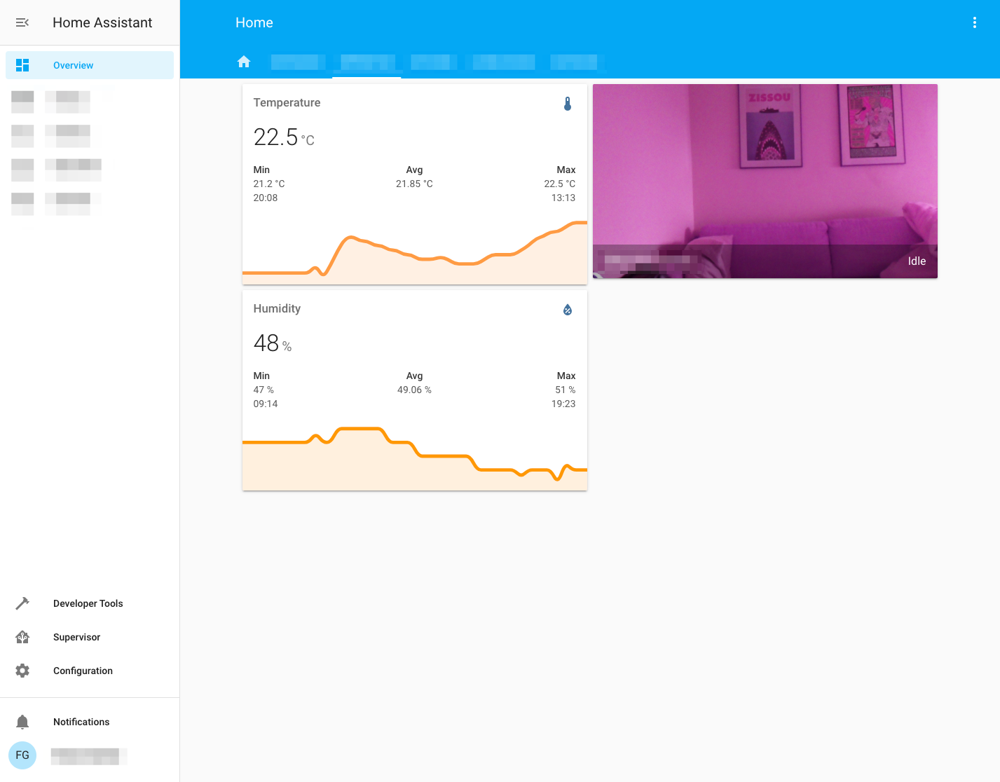

# Display a motionEye stream in Home Assistant (Lovelace)

I'm going to assume you already have a [Home Assistant](https://www.home-assistant.io/) setup running and the [motionEye](https://github.com/ccrisan/motioneye/wiki) server is working properly. For this example, we're going to use the _mjpeg_ stream from motionEye.

## Get the stream URL

The first thing we need to do is getting the URL we need for the integration. You'll find it in the "Video Stream" tab in the settings on your motionEye server. I'm using the _Fast Network Cam_ option, but you can use the normal mode as well. If you're using the normal mode, note down the Snapshot URL too, it can be used for the `still_image_url` property in the camera integration.


_Fast Network Cam Mode_


**Normal Mode**

## Home Assistant

There are several different ways to display a camera stream in Lovelace. The method I went with is the [Picture Entity Card](https://www.home-assistant.io/lovelace/picture-entity/). To use a camera in Lovelace, we need to add the [camera](https://www.home-assistant.io/integrations/mjpeg/) and [stream](https://www.home-assistant.io/integrations/stream/) integrations:

### configuration.yaml

```yaml
stream:
camera:
  - platform: mjpeg
    name: My Fancy Camera
    still_image_url: "http://URLFROMMOTIONEYE/picture/1/current/"
    mjpeg_url: "http://URLFROMMOTIONEYE:8081/mjpeg"
```

Make sure to check that the port matches the one you set in motionEye and to append `mjpeg` to actually get the MJPEG stream.

Once the camera and the stream are set up properly, we need to add the picture entity card to Lovelace:

### ui-lovelace.yaml

```yaml
- type: picture-entity
  entity: camera.my_fancy_camera
  camera_view: live
```

That's it. Restart Home Assistant and you should see the camera stream:



Sorry for the pinkish image; I'm running the [Pi NoIR Camera V2](https://www.raspberrypi.org/products/pi-noir-camera-v2/) without a filter.
