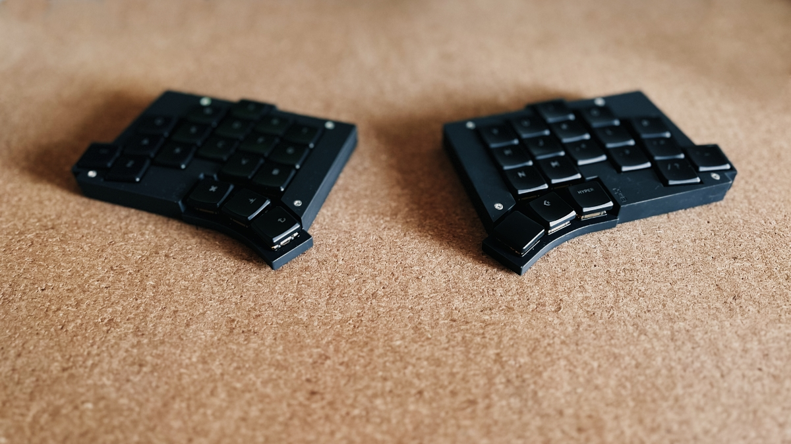

# A new keyboard – Meet the Totem

New year, new keyboard! I've been using split keyboards for a while and I'm quite satisfied with the ergonomics. However, one thing that has been bothering me about my current keyboards ([Ferris Sweep Tweaked](https://github.com/benvallack/Ferris-Sweep-Tweaked), [Lily58](https://github.com/kata0510/Lily58), and [Aurora Sofle](https://splitkb.com/collections/keyboard-kits/products/aurora-sofle-v2)) is the presence of cables. There's one cable to connect the keyboard to the computer and another cable to connect the two halves of the keyboard. I wanted to eliminate these cables and switch to a wireless keyboard.

Initially, I considered replacing or modifying my existing keyboards. But then I came across the [Totem by GEIGEIGEIST](https://github.com/GEIGEIGEIST/TOTEM). It's a wireless split keyboard, similar to the Ferris Sweep, but with four additional keys. Moreover, the last two columns on each side are slightly rotated to enhance comfort while reaching the keys.

I also wanted to try out [ZMK](https://zmk.dev/) instead of [QMK](https://docs.qmk.fm), which I've been using for all my keyboards. ZMK utilizes Github Actions for firmware building, making it more convenient than setting up a build environment on my computer. On the other hand it takes quite a lot longer to build the firmware, but I can live with that.

For the keyboard configuration, I opted for a layout similar to the one on my Ferris Sweep. I've been using that layout for a while and I'm quite happy with it. If you're curious, you can find the configuration in my [ZMK repository](https://github.com/floriangaechter/zmk-config-totem). Here's a visualization of my current keymap:

There's still room for optimization and configuration, but I'm already pleased with the Totem. It's a fantastic keyboard, and I look forward to using it for a long time.

If you're also interested in split keyboards or have any questions about the Totem, feel free to reach out to me. I'm always happy to chat about keyboards.
